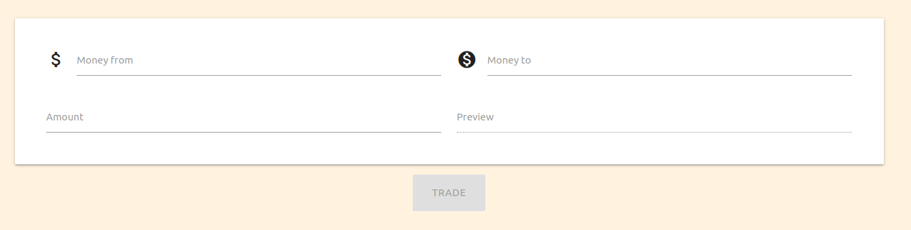
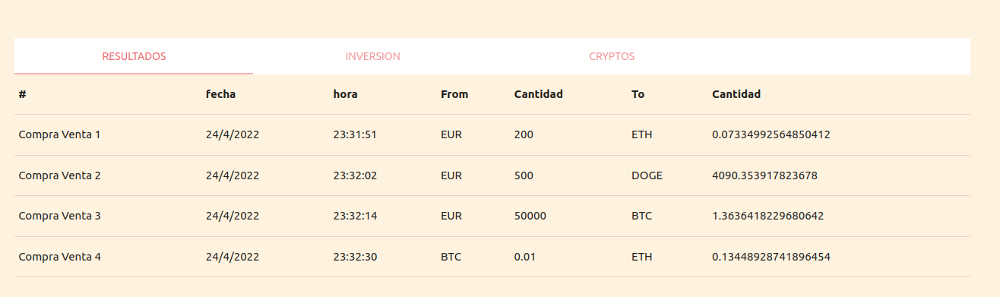
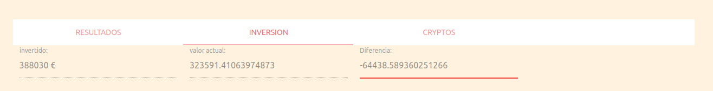
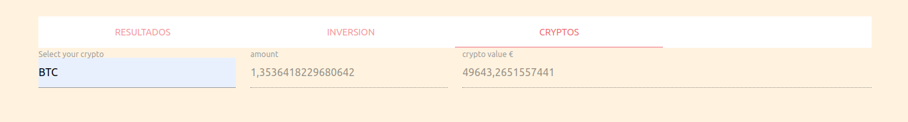

# PROYETO FLASK JS

## Cómo arrancarlo

Tienes que crear dos ficheros uno en: `balance/api_key.py` con una propiedad `api_key1` y otro para js en `balance/static/js/api_key.js` con la variable  `window.api_key1` con el valor de la clave del api

Ejecutar 
    
    pip install -r requirements.txt
    flask run

## Librerias usadas
    - flask
    - materialize para la parte visual
## Objetivo 

Consiste en una aplicación que sirva para registrar las operaciones sobre las crypto monedas.

### Tiene la opcion comprar crypto monedas

### Historico de todos los movimientos

### Estado de la inversion

### Balance de las cryptos que tienes

## Estructura del repositorio 

    (se ha sacado ejecuntando el compando tree)

    .
    ├── balance
    │   ├── api_key.py  # Claves de acceso al api  desde python Fichero se ignora en el gitignore
    │   ├── conversor_utils.py  # fichero con funciones de utilidades
    │   ├── data_code.py     # Fichero que construye la base de datos
    │   ├── __init__.py      # contructor de la app
    │   ├── money_controller.py  # Este es el unico fichero que tiene acceso a base de datos
    │   ├── routes.py    # Fichero que tiene todas las rutas de la aplicaciones
    │   ├── static
    │   │   ├── css
    │   │   │   └── style.css  # Estilos del html
    │   │   └── js
    │   │       ├── api_key.js  # Claves de acceso al api  desde js Fichero se ignora en el gitignore
    │   │       └── app.js
    │   └── templates
    │       ├── index.html # Pagina de inicio
    │       ├── registro.html  # Pagina de la app, aplicacion de una pagina
    │       ├── template.html # Plantilla que se usa para pintar todas las vistas
    │       └── widgets # Pequeñas partes de codigo que se usan en la plantilla
    │           ├── footer.html  # pie de la pagina
    │           └── header.html  # cabecera de la pagina
    ├── movimientos.db  # la base de datos, tambien se añade al gitignore
    ├── requeriments.txt  # dependencias de la app
    ├── run.py    # arranca la app